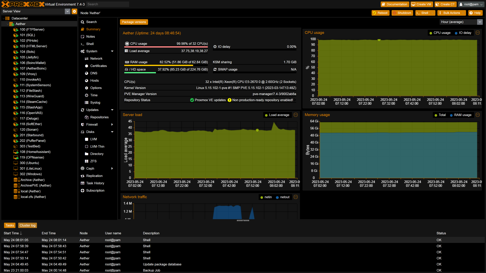
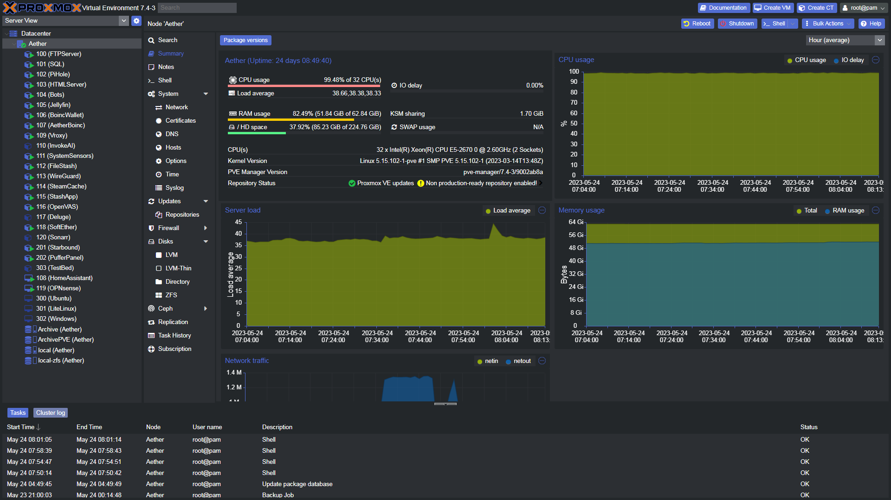
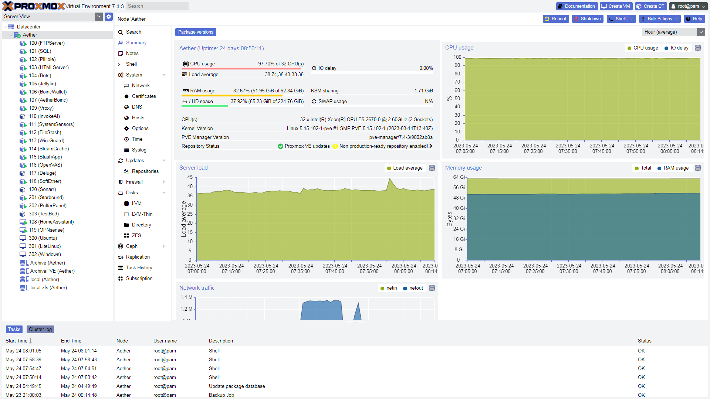
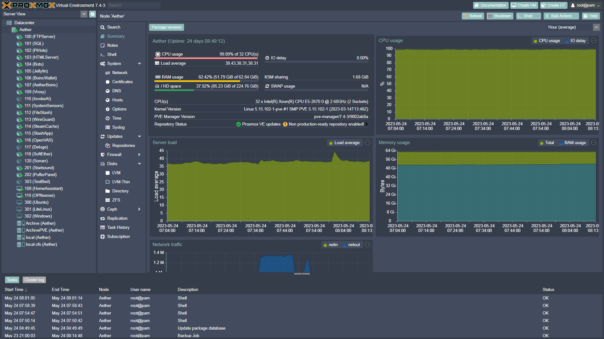

Original idea and SASS files from https://github.com/Weilbyte/PVEDiscordDark

# Supported Proxmox Versions
- 7.4
- 8.0

## UI Tweaks
there is a few additional tweaks that can be enabled using the script. These are:
- Hide the "no valid subscription" warning
- Add update buttons to the theme selector panel itself
- Add a progress bar to show how much ram ZFS Cache is using

## Installation
Run the following commands in your PVE instance:
```bash
git clone https://github.com/Telxey/Proxmox/tree/main/MOX-Themes
chmod +x install.sh
./install.sh
```

Or this one-liner:
```bash
git clone https://github.com/Telxey/Proxmox/tree/main/MOX-Themes && cd PVEThemes && chmod +x install.sh && ./install.sh
```

if you have ran the install.sh script before, you can instead just directly run the python script

    python3 PVEThemes.py

For remove or completely restore the webUI to default themes if it is broken in any way  run command below  

    apt get reinstall proxmox-widget-toolkit pve-manager 

##  Proxmox  Theme's Below                                         

---
<p align="right">
   <a href="https://www.buymeacoffee.com/telxey" target="_blank"></a>
</p>

<h2 align="center">
   $${\color{aqua}Avali \space Theme \space Sample \space For \space \color{darkorange} Proxmox.}$$
</h2>
  



<h2 align="center">
   $${\color{aqua}Discord \space Dark \space Theme \space Sample \space For \space \color{darkorange} Proxmox.}$$
</h2>




<h2 align="center">
   $${\color{aqua}Discord \space Light \space Theme \space Sample \space For \space \color{darkorange} Proxmox.}$$
</h2>




<h2 align="center">
   $${\color{aqua}Nordigr \space Theme \space Sample \space For \space \color{darkorange} Proxmox.}$$
</h2>



---
<p align="center">
   <a href="https://www.buymeacoffee.com/telxey" target="_blank"></a>
</p>
